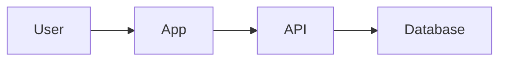
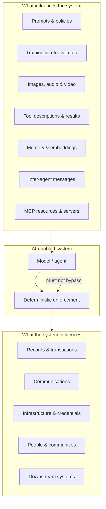

# Chapter 2: Why AI Changes Threat Modeling

*The AI Threat Modeling Framework*

---

## Thirteen shifts that change the practice

These shifts are not a checklist to memorize. They are lenses—questions to bring into the room when someone says "the architecture hasn't changed, so we're fine."

### 1. Probabilistic behavior replaces deterministic logic

Traditional software, inspected carefully, does what the code says—modulo bugs and race conditions. AI systems produce outputs drawn from distributions. The same input can yield different results. "Correct" becomes a statistical claim bounded by evaluation, not a proof.

**Threat-modeling implication:** You cannot rely on "the model will refuse" as a control. You model failure modes, abuse cases, and the **enforcement layer outside the model** that must hold regardless of model behavior.

### 2. Behavior changes without code changes

A team can alter system behavior by changing prompts, policies, retrieval corpora, tool descriptions, memory contents, model versions, or provider configurations—often with lighter review than a production code deploy.

**Threat-modeling implication:** Your threat model decays even when the architecture diagram is frozen. Change triggers must include non-code artifacts.

### 3. Natural language—and multimodal content—is data and instruction

In conventional systems, data and code are separable. In AI systems, a document, email, webpage, image caption, tool schema, or MCP resource can simultaneously be **content to process** and **instructions to follow**. Attackers know this. So do misconfigured integrations.

The risk does not stop at text. Vision- and audio-capable agents treat images, audio transcripts, and video frames as context channels too—and those channels carry instruction risk that text-only reviews miss:

- **Hidden or steganographic instructions** embedded in images (text in pixels, QR codes, barely visible overlays) that survive upload and reach the model
- **Audio transcripts** that carry injection payloads the human listener would dismiss as noise
- **Synthetic or manipulated media** the model generates or cites, which users may treat as authentic—deepfake risk when output represents real people or organizations

A screenshot of an internal wiki page is not "just an image." It is a document the model may read, obey, and act on.

**Threat-modeling implication:** Every context channel—including image, audio, and video—is a potential instruction channel. Data-flow diagrams alone are insufficient; you need **influence diagrams** that name each modality and its sanitization path.

### 4. Tools turn language into action

A model that can call APIs, run commands, update records, send messages, or approve transactions is not just generating text. It is exercising **authority**. That authority may be broader than any single tool suggests when tools are composed.

**Threat-modeling implication:** Inventory capabilities by consequence class: read, write, execute, communicate, transact, delegate. Map maximum blast radius.

### 5. Authority expands invisibly

Delegation chains, shared credentials, broad OAuth scopes, cached tokens, inter-agent handoffs, and "temporary" elevated permissions can create effective authority that no single architecture review documented.

**Threat-modeling implication:** Model **delegation and composition**, not just components. Ask: what is the most powerful thing this system can do with its current configuration?

### 6. The supply chain is wider and stranger

Training data, fine-tuning datasets, base models, adapters, embeddings, prompt libraries, third-party tools, MCP servers, plugins, and hosted memory services all introduce trust assumptions. Compromise or drift in any layer can change behavior downstream.

The model and its training data are also **assets attackers target directly**—not only the system built around them:

- **Model extraction** via repeated API probing to reconstruct weights or behavior
- **Training-data extraction** and **membership inference** to recover sensitive examples
- **Embedding inversion** to reconstruct source material from vector representations

These attacks bypass your authority model entirely. They do not need tool access or credential theft—they need only query access and patience.

**Threat-modeling implication:** Extend supply-chain analysis beyond npm packages and container images to **model, data, context, and tool provenance**—and treat the model and its data as first-class assets with their own threat surface.

### 7. Failures are multidimensional

An AI incident can simultaneously be a security breach, a privacy violation, a safety failure, a reliability problem, and a source of reputational or societal harm. Teams organized in silos can each be "right" locally and wrong globally.

**Threat-modeling implication:** Include security, privacy, safety, misuse, and human impact in the same conversation—not as afterthought checklists.

### 8. Controls inside the model are probabilistic—and evaluations can be gamed

Guardrails, classifiers, and safety filters are valuable. They are also fallible—especially under adversarial pressure, distribution shift, or creative composition of tools and context.

The same fragility applies to **evaluation itself**. Once a benchmark, red-team score, or safety metric becomes a procurement gate, compliance checkbox, or marketing claim, teams optimize for the measure—not necessarily for safety. Goodhart's law applies to AI eval: the evaluation stops being a reliable signal when it becomes the target. A passing score from six months ago, against last quarter's model and last year's adversary, is not evidence that today's system is safe.

**Threat-modeling implication:** Critical boundaries—who can access what, what can be spent, what can be exfiltrated—belong in **deterministic enforcement** outside the reasoning loop. Treat evaluations as **dated evidence with stated scope**, not as permanent proof—and refresh them when the model, prompts, tools, or threat landscape change.

### 9. Observability is harder and more necessary

Understanding *why* an agent took an action requires tracing intent, retrieved context, tool calls, identity, authorization decisions, and outcomes—often across multiple services. The system being monitored may also be the system that generates logs.

**Threat-modeling implication:** Design monitoring that is protected from the system it monitors. Plan for interruption and recovery, not just detection.

### 10. Stakeholders extend beyond users

People who never interact with your application can still be harmed—through automated decisions, generated content, downstream integrations, or environmental effects of deployed systems.

**Threat-modeling implication:** Abuse-case analysis must include **affected communities**, not only authenticated users on the happy path.

### 11. Cost is an attack surface

Inference is metered. An attacker—or a bug, or an unbounded agent loop—can cause harm purely by consuming spend: expensive tool chains, oversized context windows, retry storms, or many individually policy-compliant requests. No data is touched and no access rule is technically violated, yet the system, and the budget behind it, can still be taken down.

This is **denial-of-wallet**: a failure class distinct from data exfiltration or privilege escalation, and increasingly common in usage-based AI products where every token and tool call has a price.

**Threat-modeling implication:** Treat cost and resource consumption as their own consequence class, not a footnote to availability. Model per-session and per-account spend limits alongside authorization limits.

### 12. Long-lived memory decouples poisoning from harm

A single adversarial prompt is bad. A memory system that **accumulates influence across sessions or users** is worse in a different way: the poisoning event and the harm can be separated by days, owners, or organizational boundaries.

Consider an agent that stores user preferences, conversation summaries, or retrieved facts in persistent memory. An attacker who plants a malicious instruction today may not trigger harm until a different user—or the same user, in a different context—reads that memory back into a high-authority workflow. The incident timeline no longer fits a single request-response diagram.

**Threat-modeling implication:** Threat-model memory as a **slow-moving influence channel** with its own trust boundaries, retention policy, and review triggers—not as passive storage.

### 13. Generated content can become a downstream attack vector

When a model produces images, audio, code, or documents that other people or systems consume, the output is not the end of the story—it is input to someone else's workflow. Synthetic media can impersonate individuals. Generated code can ship to production. A confident wrong answer can become a policy decision.

**Threat-modeling implication:** Include **downstream consumers** in your consequence map: who will trust this output, act on it, or redistribute it without verifying it?

## The core diagram shift

Traditional threat modeling often centers on components and data flows:

AI threat modeling must also represent influence, authority, and consequence:

The dashed line matters. If the model can route around enforcement, you do not have a boundary—you have a suggestion.

## What this means for your next session

If your threat model answers only "what are the components and where does data go," it is incomplete for AI systems. Your next session should also answer:

| Question | Why it matters |
|----------|----------------|
| What can influence model behavior without a code deploy? | Catches prompt, policy, retrieval, and config drift |
| What is the maximum authority this system can exercise? | Surfaces scope creep and composition risk |
| Where is enforcement deterministic vs. probabilistic? | Separates real controls from hopeful instructions |
| What happens when context is adversarial? | Addresses injection, poisoning, and tool manipulation |
| Who can be harmed without being a user? | Expands abuse cases beyond happy-path personas |
| What evidence supports current autonomy levels? | Connects threat modeling to governance decisions |
| What would trigger a threat-model refresh? | Prevents diagram freeze |
| What is the maximum spend or resource consumption this system could trigger unattended? | Catches denial-of-wallet and runaway-loop failure modes |
| What multimodal inputs can reach the model, and how are they sanitized? | Catches image, audio, and video instruction channels |
| What could an attacker learn by querying the model or embeddings alone? | Catches model extraction and training-data leakage |
| What is stored in memory, for how long, and who can influence it? | Catches slow-burn poisoning across sessions |

## What we carry forward

From the Threat Modeling Manifesto and decades of practice, we keep:

- Threat modeling as a design discipline, not a paperwork exercise
- Diverse perspectives in the room
- Outputs that change architecture, controls, and operations
- Continuous practice, not one-time review
- Clarity about assumptions and open questions

What we add is the vocabulary and priorities for systems where **behavior, authority, and consequence** are dynamic, contextual, and often probabilistic.

---

**Previous:** [Chapter 1 — Introduction](01-introduction.md) · **Next:** [Chapter 3 — Our Values](03-values.md)
