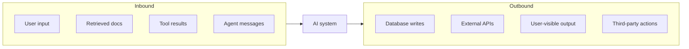

# Chapter 4: Our Principles

*The AI Threat Modeling Framework*

---

## Twelve principles for practice

Our principles are concise, technology-neutral, and decision-relevant. Each should change how you threat model—not merely what you write down.

For each principle: the statement, why it matters, what to do in practice, an **on-track signal** (what good looks like while it is working), and an **off-track signal** (what failure looks like).

---

## Principle 1: Model the whole socio-technical system

**Statement:** Include the user, model, prompts, policies, training and evaluation data, retrieval sources, memory, embeddings, tools, agents, MCP clients and servers, identity, infrastructure, people, downstream systems, business process, and affected communities.

**Why it matters:** Risk emerges from interactions. A secure model behind a porous tool layer is not secure. A careful application atop poisoned retrieval is not careful.

**In practice:**

- Build a system map that includes human roles, automated agents, and external services
- Include offline and batch processes—not only online request paths
- Name third-party providers and what you trust them for
- Identify communities affected without direct product access

**On-track signal:** Your system map names humans, offline jobs, third-party providers, and at least one affected non-user. Reviewers from different disciplines recognize their piece of the diagram.

**Off-track signal:** Your threat model fits on one slide and mentions only the model API.

| Layer | Examples to include |
|-------|---------------------|
| Human | Users, operators, reviewers, affected non-users |
| Cognitive | Models, prompts, policies, classifiers |
| Context | Retrieval, memory, embeddings, caches |
| Action | Tools, plugins, MCP servers, workflows |
| Foundation | Identity, network, secrets, audit stores |

---

## Principle 2: Model both directions of influence

**Statement:** Ask both what can influence the AI system, and what people, data, systems, decisions, and environments the AI system can influence.

**Why it matters:** Many failures are discovered only when you reverse the arrow. Indirect influence—through generated content, automated decisions, or chained agents—is still influence.

**In practice:**

- Maintain an **inbound influence map**: prompts, data, tools, messages, media, configuration
- Maintain an **outbound consequence map**: records, payments, messages, infrastructure, reputational harm
- Trace multi-hop paths: agent A influences agent B influences database C

**On-track signal:** You can walk a skeptical auditor from "what enters the system" to "who could be harmed three hops later" without hand-waving.

**Off-track signal:** You can describe data ingestion but not downstream blast radius.

---

## Principle 3: Treat authority as a primary asset and attack surface

**Statement:** Document credentials, delegated identities, scopes, tool permissions, approval rights, communication channels, financial authority, and the maximum consequence of combined capabilities.

**Why it matters:** Attackers pursue authority. Insiders misuse it. Agents accumulate it silently through scope creep and composition.

**In practice:**

- Create a **capability and authority map** alongside your architecture diagram
- Classify actions: read, write, execute, communicate, transact, delegate
- Calculate effective authority after tool chaining and delegation
- Review OAuth scopes, API keys, service accounts, and MCP permissions together

**On-track signal:** A capability map exists, is reviewed when tools or scopes change, and someone can state the worst credible outcome with current configuration.

**Off-track signal:** You know the app has "admin access" but cannot list every action that enables.

*See also Principle 6 for how individually acceptable authorities combine into greater effective power.*

---

## Principle 4: Separate reasoning from enforcement

**Statement:** Do not depend on a probabilistic model to enforce critical authorization, isolation, transaction, or data-access boundaries. Use independently enforced policy where failure has material consequences.

**Why it matters:** Models can be persuaded, confused, jailbroken, or simply wrong. Enforcement must not require model cooperation.

**In practice:**

- Place allowlists, transaction limits, field-level access control, and network policy **outside** the model loop
- Treat prompts and safety classifiers as **defense in depth**, not primary access control
- Verify that tool gateways cannot be bypassed via alternate prompts or agents

**On-track signal:** You can point to specific policy rules outside the model that block high-consequence actions—and you have tested bypass attempts.

**Off-track signal:** Removing or rewriting the system prompt would eliminate your main security control.

| Consequence level | Enforcement expectation |
|-------------------|-------------------------|
| Low / reversible | Model + monitoring may suffice |
| Medium | Policy gateway + human review for edge cases |
| High / irreversible | Deterministic enforcement + attribution + limits |

---

## Principle 5: Assume every context channel can carry instructions

**Statement:** Model prompts, documents, webpages, emails, images, audio, tool descriptions, schemas, tool results, memory, inter-agent messages, and MCP resources as potential instruction and data channels.

**Why it matters:** Instruction injection and tool poisoning exploit the ambiguity between content and commands. Defenders who treat retrieved text as "safe data" lose.

**In practice:**

- Threat-model **each context source** with its own trust level and failure modes
- Include adversarial retrieval, poisoned documents, malicious tool metadata, and compromised MCP resources
- Design parsing and isolation so instruction-bearing content cannot silently elevate privilege

**On-track signal:** Each context source has a documented trust level, sanitization step, and abuse-case coverage—including retrieval, tool results, and multimodal inputs where applicable.

**Off-track signal:** Your abuse cases assume attackers only control the chat input box.

---

## Principle 6: Threat model emergence and composition

**Statement:** Analyze risks created by chaining individually acceptable tools, agents, permissions, and data sources. The system's effective power may be greater than the sum of its components.

**Why it matters:** A read tool plus a write tool plus a messaging tool can become an exfiltration pipeline. Multi-agent workflows create emergent behavior no single agent review captured.

**In practice:**

- Review **workflows**, not only individual tools or agents
- Ask composition questions: "What becomes possible when A and B are used together?"
- Apply least privilege to **combinations**, not only components
- Study OWASP multi-agent and agentic guidance for interaction risks

**On-track signal:** Workflow-level reviews exist. Someone has asked "what becomes possible when A and B are used together?" and documented the answer.

**Off-track signal:** Each agent passed review, but no one reviewed the delegation graph.

*See also Principle 3 for documenting the authority each component contributes to that composition.*

---

## Principle 7: Earn autonomy with evidence

**Statement:** Increase autonomy per action and workflow only when evaluation, monitoring, incident data, and consequence analysis support it. Allow autonomy to be reduced when behavior or risk changes.

**Why it matters:** Autonomy is not a default entitlement. It is a grant backed by evidence—and revocable when evidence changes.

**In practice:**

- Define autonomy tiers with explicit promotion criteria
- Tie expanded tool access to adversarial evaluation results
- Automate **downgrade paths** when drift, incidents, or policy violations occur
- Document who can approve autonomy increases and on what evidence

**On-track signal:** Autonomy tiers are written down, tied to evidence, and downgrade paths are tested—not only promotion paths.

**Off-track signal:** The agent shipped with full production credentials "to move fast."

| Autonomy tier | Typical evidence expected |
|---------------|---------------------------|
| Suggest only | Basic evals, logging in place |
| Act with review | Scenario testing, low blast radius |
| Act within bounds | Adversarial evals, deterministic limits |
| Delegate to other agents | Multi-agent threat model, composition review |

---

## Principle 8: Design for observation, interruption, and recovery

**Statement:** High-impact actions should be attributable, detectable, interruptible, rate-limited where appropriate, and reversible where feasible. Monitoring must be protected from the system it monitors.

**Why it matters:** You will not prevent every failure. You can still limit duration, scope, and harm—and learn.

**In practice:**

- Log intent, context summary, tool call, identity, policy decision, and outcome
- Implement kill switches, credential revocation, and transaction caps
- Ensure telemetry pipelines are tamper-resistant relative to the agent
- Run incident playbooks that assume agent compromise, not only user compromise

**On-track signal:** You can reconstruct a multi-step agent action from logs within minutes, interrupt it with a tested kill switch, and reverse or contain impact within defined windows.

**Off-track signal:** You cannot answer "which agent did this, under whose authority, using what context?"

---

## Principle 9: Model change, drift, and decay

**Statement:** Refresh the threat model when models, providers, prompts, policies, tools, scopes, data, memory, orchestration, or consequences change—not only when application code changes.

**Why it matters:** Behavioral drift is a security property. The Tuesday retrieval update is a deploy.

**In practice:**

- Maintain a **threat-model refresh policy** with explicit triggers (see [refresh-triggers.md](refresh-triggers.md))
- Version and link threat models to model IDs, prompt versions, tool manifests, and MCP configs
- Schedule periodic review even when no trigger fired—assumptions age

**On-track signal:** Threat models are version-linked to models, prompts, tools, and data corpora. Triggers fire automatically or on a defined schedule—and someone owns the response.

**Off-track signal:** Last threat model update references a model version three releases ago.

**Common refresh triggers:**

| Category | Examples |
|----------|----------|
| Model | New base model, fine-tune, adapter, provider change |
| Context | Retrieval corpus, embeddings rebuild, memory schema |
| Authority | New tool, expanded scope, new MCP server |
| Integration | New downstream system, new data class |
| Consequence | New user population, regulatory scope, financial exposure |

---

## Principle 10: Include misuse, failure, and human impact

**Statement:** Consider malicious use, accidental failure, foreseeable misuse, overreliance, insider threats, compromised dependencies, and harms to people who never directly interact with the system.

**Why it matters:** Not every harm is a hack. Not every victim is a user. Threat modeling that only lists CVE classes misses how AI systems fail in the real world.

**In practice:**

- Run abuse-case workshops with diverse participants
- Include insider, supplier, and nation-state scenarios where relevant
- Model overreliance and automation bias as system risks
- Document harms to non-users: bystanders, subjects of decisions, communities

**On-track signal:** Abuse-case workshops included people who are not on the security team. Non-user harms and overreliance appear as first-class threats, not footnotes.

**Off-track signal:** Your misuse section is a copy of your external attacker section.

---

## Principle 11: State uncertainty honestly

**Statement:** Record assumptions, confidence, evidence gaps, residual risk, and unknown behavior. A passing benchmark is evidence for a bounded claim, not proof of universal safety.

**Why it matters:** False certainty drives bad autonomy decisions. Honest uncertainty enables proportionate controls and informed risk acceptance.

**In practice:**

- Label claims: known, assumed, unknown, monitored
- Tie controls to specific threats—not generic "AI safety"
- Record residual risk with named owners and review dates
- Avoid benchmark absolutism; describe evaluation scope and limits

**On-track signal:** Documentation distinguishes known, assumed, and unknown behavior. Benchmark results include scope, date, and known gaps.

**Off-track signal:** "The model is safe" appears in documentation without qualification.

---

## Principle 12: Connect analysis to action

**Statement:** Every material threat should lead to a decision: mitigate, avoid, transfer, accept with an accountable owner, or investigate further. Threat-modeling output must influence design and operations.

**Why it matters:** A threat model that does not change decisions is expensive wallpaper.

**In practice:**

- Require an owner and disposition for each material finding
- Link threats to controls, tests, and monitoring—not only to Jira tickets
- Reject "document and forget" workflows
- Close the loop: verify controls address the threats they claim to address

**On-track signal:** Every material threat has an owner, disposition, and linked control or test. Post-review, something actually changed.

**Off-track signal:** The threat model PDF timestamp is newer than the architecture, but nothing else changed.

---

## Principles checklist

Use this in workshops and design reviews. Not every principle applies equally to every system—a predictive scoring API with no natural-language input may mark Principle 5 as **N/A** rather than forcing a checkbox. Skipping the checklist entirely because "we're not an LLM" is the failure mode; selective application with documented rationale is the goal.

| # | Principle | Pass? | N/A? | Notes |
|---|-----------|-------|------|-------|
| 1 | Whole socio-technical system modeled | ☐ | ☐ | |
| 2 | Both directions of influence traced | ☐ | ☐ | |
| 3 | Authority documented as attack surface | ☐ | ☐ | |
| 4 | Critical enforcement outside model | ☐ | ☐ | |
| 5 | Context channels treated as instruction-capable | ☐ | ☐ | Often N/A for non-LLM predictive ML |
| 6 | Composition and emergence analyzed | ☐ | ☐ | |
| 7 | Autonomy tied to evidence | ☐ | ☐ | |
| 8 | Observation, interruption, recovery designed | ☐ | ☐ | |
| 9 | Change and drift triggers defined | ☐ | ☐ | |
| 10 | Misuse and human impact included | ☐ | ☐ | |
| 11 | Uncertainty stated honestly | ☐ | ☐ | |
| 12 | Threats connected to decisions | ☐ | ☐ | |

---

**Previous:** [Chapter 3 — Our Values](03-values.md) · **Next:** [Chapter 5 — Patterns We Encourage](05-patterns.md)
