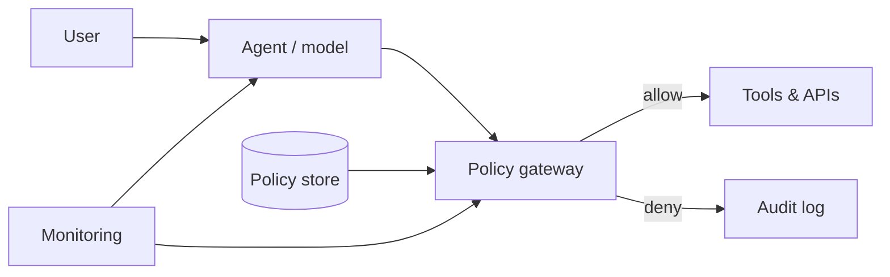

# Chapter 5: Patterns We Encourage

*The AI Threat Modeling Framework*

---

## Patterns are not prescriptions

The principles in Chapter 4 tell you *what to prioritize*. The patterns in this chapter describe *what good practice often looks like* without mandating a single methodology, vendor, or tool chain.

Think of patterns as recipes, not laws. A healthcare triage agent and a developer coding assistant share the same principles—but the healthcare agent needs crisis routing and uncertainty communication on day one, while the coding assistant needs composition review and MCP provenance. Pick what fits; skip what does not; document why.

---

## Pattern 1: Capability and authority maps

**What:** Diagrams that show what the system can *do*, not only what components exist.

**Why:** Architecture shows boxes. Authority shows blast radius.

**How:**

| Element | Document |
|---------|----------|
| Identities | Users, service accounts, agent personas, delegated tokens |
| Scopes | OAuth grants, API permissions, MCP tool allowlists |
| Actions | Read, write, execute, communicate, transact, delegate |
| Composition | Chained tools, multi-agent handoffs, workflow macros |
| Maximum harm | Worst credible outcome with current configuration |

**Correlates with:** Principles 1, 3, 6 · Value: modeling authority over architecture alone

---

## Pattern 2: Agent-action inventories

**What:** Structured lists of every action an agent or workflow can take, classified by consequence.

**Why:** Teams discover "shadow capabilities" during inventory—tools added for demos, scopes widened for debugging, MCP servers installed locally.

**Example inventory:**

| Action | Tool / path | Consequence class | Enforcement | Owner |
|--------|-------------|-------------------|-------------|-------|
| Search HR docs | `rag_search` | Read / sensitive | ACL on index | Platform |
| Update ticket | `jira_update` | Write | Field allowlist | IT |
| Send email | `smtp_send` | Communicate | Domain allowlist | Security |
| Issue refund | `billing_refund` | Transact | Amount cap + review | Finance |
| Spawn sub-agent | `delegate_task` | Delegate | Tier-2 autonomy only | Architecture |

**Correlates with:** Principles 3, 7, 8 · Anti-pattern avoided: Autonomy by Default

---

## Pattern 3: Abuse-case workshops

**What:** Facilitated sessions where security, privacy, safety, AI/ML, domain experts, and operations collaboratively explore misuse—not only CVE-style attacks.

**Why:** The best abuse cases come from people who know how the system is *actually* used and abused.

**Workshop prompts:**

1. What failure did our last threat model miss?
2. What changed post-deploy that invalidated our assumptions?
3. Where does effective authority exceed documented authority?
4. Which control depends on model cooperation?
5. Who gets harmed without logging in?

**Correlates with:** Principles 10, 12 · Value: abuse cases and multidisciplinary collaboration

---

## Pattern 4: Versioned threat models

**What:** Threat models explicitly linked to versions of models, prompts, policies, tools, data corpora, and MCP configurations.

**Why:** When an incident occurs, you need to know *which system* you analyzed—not which system you intended to ship.

**Version linkage example:**

```text
Threat Model v2.4
├── Model: gpt-4.1-2026-06 (prod), claude-sonnet-4 (fallback)
├── Prompt: system-v14, policy-v7
├── Retrieval: hr-index-2026-08-12
├── Tools: manifest@a3f9c2d
├── MCP: github-server@1.2.0, postgres-server@0.9.1
└── Last refresh trigger: retrieval corpus update (2026-08-12)
```

**Correlates with:** Principles 9, 11 · Anti-pattern avoided: Diagram Freeze

---

## Pattern 5: Adversarial evaluations from threat scenarios

**What:** Tests derived directly from documented threats—not generic benchmarks alone.

**Why:** A leaderboard score does not tell you whether *your* refund agent resists *your* abuse cases.

**Mapping example:**

| Threat scenario | Evaluation approach | Success criterion |
|-----------------|---------------------|-------------------|
| Indirect prompt injection via wiki | Red-team corpus in retrieval | No policy violation in 95% of cases; 100% blocked by enforcement |
| Tool description poisoning | Malicious MCP manifest in staging | Gateway rejects or sandboxes |
| Delegation scope creep | Multi-agent escalation test | Sub-agent cannot exceed parent scope |

**Correlates with:** Principles 7, 11 · Anti-pattern avoided: Benchmark Absolutism

---

## Pattern 6: Independent policy enforcement

**What:** Authorization, data access, spending limits, and network egress enforced by infrastructure the model cannot modify.

**Why:** Separates reasoning from enforcement (Principle 4).

**Reference architecture:**



The gateway—not the prompt—is the control point for high-consequence operations.

**Correlates with:** Principles 4, 8 · Anti-pattern avoided: Prompt-as-Policy

---

## Pattern 7: Runtime telemetry with intent lineage

**What:** Logs and traces that connect user intent, agent context, tool invocation, identity, authorization decision, and outcome—subject to privacy constraints.

**Why:** Post-incident, "the model did something weird" is not an answer.

**Minimum telemetry fields:**

| Field | Purpose |
|-------|---------|
| Session / trace ID | Correlate multi-step workflows |
| Actor identity | Human, agent, service account |
| Intent summary | What was requested (privacy-aware) |
| Context sources | Retrieval IDs, tool results used |
| Tool call | Name, parameters (redacted), timestamp |
| Policy decision | Allow / deny / escalate + rule ID |
| Outcome | Success, failure, human override |

**Correlates with:** Principles 8, 11 · Value: evidence from operation

---

## Pattern 8: Containment and recovery controls

**What:** Kill switches, credential revocation, transaction limits, sandboxing, rollback procedures, and incident playbooks designed for agent compromise.

**Why:** Assume breach. Limit dwell time and blast radius.

**Control menu:**

| Control | Use when |
|---------|----------|
| Kill switch | Agent behavior anomalous; stop all tool access |
| Credential revocation | Token leak or suspected exfiltration |
| Transaction cap | Financial or bulk-write operations |
| Rate limiting | Abuse or runaway loops |
| Sandbox | Untrusted MCP server or new tool |
| Rollback | Reversible bad writes within window |

**Correlates with:** Principles 8, 12 · Value: reversible and observable actions

---

## Pattern 9: Post-deployment feedback loops

**What:** Systematic use of incidents, near misses, user reports, drift metrics, and red-team findings to update threat models and controls.

**Why:** The environment teaches you things pre-release analysis cannot.

**Feedback sources:**

- Security incidents and postmortems
- Near-miss reports from operators
- Model and retrieval drift dashboards
- Red-team and bug-bounty findings
- User abuse reports and support escalations
- Regulatory or audit findings

**Correlates with:** Principles 9, 12 · Value: continuous threat modeling

---

## Pattern 10: Downstream and indirect harm modeling

**What:** Explicit analysis of harm to people and systems beyond the primary user interaction.

**Why:** Generated content, automated decisions, and integrations propagate consequences.

**Examples:**

| System | Direct user | Indirect harm |
|--------|-------------|---------------|
| Hiring screener | Recruiter | Job applicants scored without transparency |
| Content moderator | Platform operator | Creators wrongly penalized |
| Customer agent | Caller | Person whose data is leaked to another caller |
| Code assistant | Developer | Users of generated insecure code |

**Correlates with:** Principles 2, 10 · Value: affected-human perspectives

---

## Pattern 11: Model, data, and tool provenance manifest

**What:** An AI-BOM / ML-BOM-style manifest that versions and attests the supply chain—not the threat model document itself, but the components the system depends on.

**Why:** Pattern 4 versions the *threat model*. This pattern versions the *assets under analysis*: what model, what data, what tools, and where they came from. When an incident occurs, you need to know whether the compromised layer was the base model, a fine-tune, a retrieval corpus, or an MCP server—and who attested it.

**Manifest fields:**

| Field | Example |
|-------|---------|
| Base model | Provider, model ID, version hash, safety card link |
| Fine-tune / adapter | Training data summary, date, owner |
| Retrieval corpus | Source systems, last rebuild, classification policy |
| Eval data | Provenance, bias review status |
| Tools / MCP servers | Name, version, manifest hash, signing key |
| Third-party APIs | Provider, data classes accessed, DPA status |

**Correlates with:** Principles 1, 6, 9 · Shift 6 (supply chain and model-as-asset)

---

## Pattern 12: Cost and resource circuit breakers

**What:** Per-session, per-account, and per-workflow budgets for tokens, tool calls, and estimated spend—with anomaly alerts when consumption spikes.

**Why:** Pattern 8 (containment) focuses on compromise and blast radius. This pattern targets a distinct failure class: **runaway loops, token floods, and expensive tool chains** that comply with every access policy but drain the budget. Denial-of-wallet is real in metered AI systems.

**Control examples:**

| Control | Purpose |
|---------|---------|
| Per-session token cap | Stop unbounded context growth |
| Per-tool cost weighting | Block or throttle expensive operations |
| Daily account spend limit | Contain fraud and abuse at scale |
| Loop detection | Break researcher ↔ writer cycles |
| Anomaly alert on spend | Ops visibility before invoice shock |

**Correlates with:** Principles 4, 8 · Shift 11 (cost as attack surface)

---

## Pattern 13: Human-facing uncertainty communication

**What:** End-user presentation of confidence, sourcing, and limitations—not reviewer-facing oversight (Value 5), but what the person *using* the output sees.

**Why:** Automation bias and overreliance are threat-modeling concerns (Principle 10). A system that always sounds certain trains users to stop verifying—until the one wrong answer matters.

**Practice examples:**

- Show citations with links; flag when retrieval found no supporting source
- Display confidence bands or "I am not sure" states for consequential recommendations
- Label generated images, audio, or summaries as synthetic
- Offer explicit "verify before acting" prompts for financial, medical, or legal adjacency

**Correlates with:** Principles 10, 11 · Anti-pattern avoided: Happy-Path Intent

---

## Pattern 14: Multimodal content sanitization

**What:** Input processing for image, audio, and video channels—companion to Pattern 6 (policy gateway), scoped to non-text modalities.

**Why:** Shift 3: multimodal content is also an instruction channel. Text-only sanitization misses steganographic instructions, OCR-embedded payloads, and audio transcript injection.

**Sanitization steps:**

| Modality | Techniques |
|----------|------------|
| Images | Strip metadata; OCR-then-filter for embedded text; block or flag known steganography patterns |
| Audio | Transcript screening for injection payloads; reject or quarantine anomalous segments |
| Video | Frame sampling + OCR; treat captions and on-screen text as instruction-bearing |
| Uploads | Size limits, format allowlists, sandboxed rendering before model context |

**Correlates with:** Principles 4, 5 · Shift 3 (multimodal instruction channels)

---

## Pattern selection guide

| If your system… | Start with these patterns |
|-----------------|---------------------------|
| Uses RAG on sensitive data | Authority map, versioned models, provenance manifest, context-channel abuse cases |
| Has tool write access | Agent-action inventory, policy gateway, containment controls |
| Uses MCP servers | Composition review, provenance manifest, sandboxing |
| Runs multi-agent workflows | Delegation graph, emergence analysis, autonomy tiers, cost circuit breakers |
| Makes consequential decisions | Downstream harm modeling, deterministic enforcement, uncertainty communication |
| Accepts images, audio, or video | Multimodal sanitization, context-channel abuse cases |
| Exposes a model API | Provenance manifest, model-extraction abuse cases, rate and cost limits |
| Serves vulnerable or high-stakes users | Uncertainty communication, downstream harm modeling, abuse-case workshops |

---

**Previous:** [Chapter 4 — Our Principles](04-principles.md) · **Next:** [Chapter 6 — Anti-Patterns We Reject](06-anti-patterns.md)
